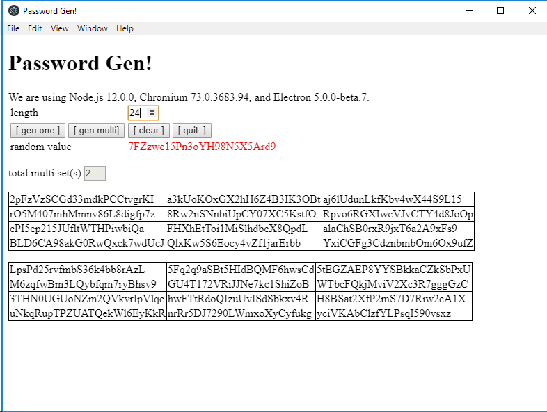

# gen-rand
Random Password Generator

Just another kinda `hello world` app using Electron framework
Generates multiple passwords with random alpha-numeric characters.

# installation

1. Install `npm` from https://nodejs.org/en/download/
1. `git clone https://github.com/kesavanm/gen-rand.git`
1. `cd gen-rand`
1. `npm install`
1. `npm start`

#screen-shot

